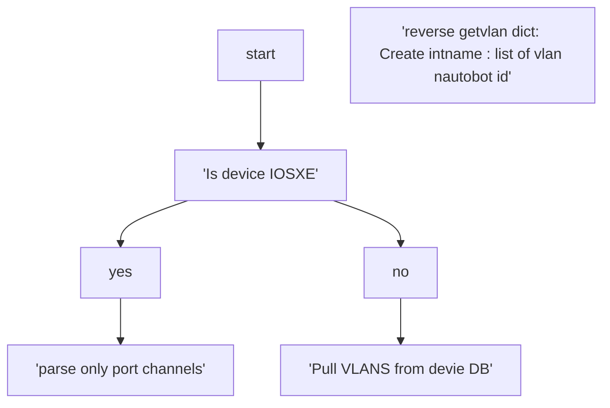

# Nautobot Cleaner

### what it does?

This isnt really a cleaner, just tried to tackle vlan importing that
the Network To Code Vlan importer does not do well in a multi-tenant enviroment
with multiple broadcast domains container same VLAN IDs but different workloads

### How it works?

Uses Napalm to connect to device, pulls vlan and iterates through and adds data.

### How to use?

for now, as im testing, instantiate the class, call the method against the router/switch you are importing vlans for.

