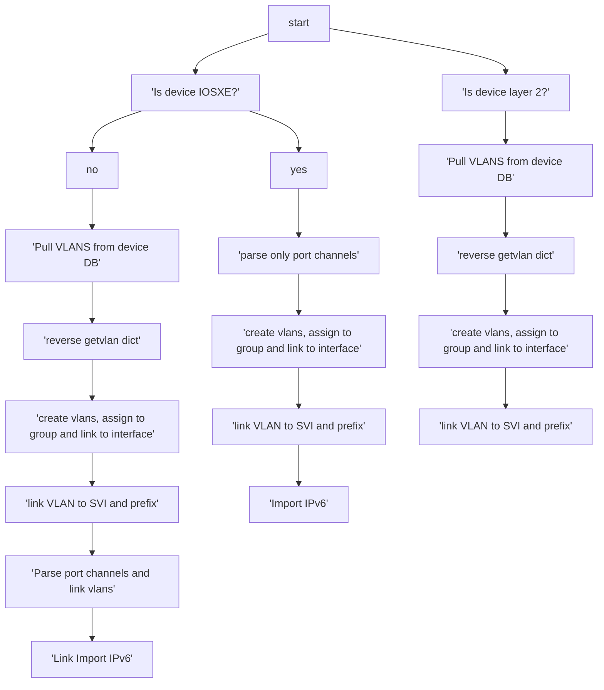

# Nautobot Cleaner

### what it does?

Cleaner isnt the best word, but it helps to import data that network importer does not do well in a multi-tenant enviroment.

### How it works?

Uses a mix of Napalm and Netmiko to parse vlan information and create it in Nautobot

### How to use?

Instantiate the class and pass in selected devices and vlan group


```python
from importdevicevlans import NautobotCleaner

nbc = NautobotCleaner()
nbc.importdevicevlans(selected_devices=[
    'device1-fqdn',
    'device2-fqdn',
],
    group='vlan-group')
```
